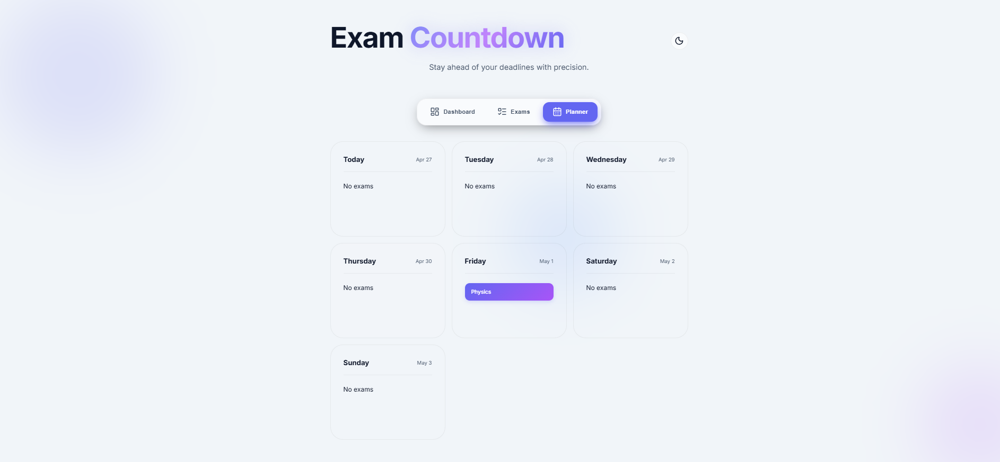
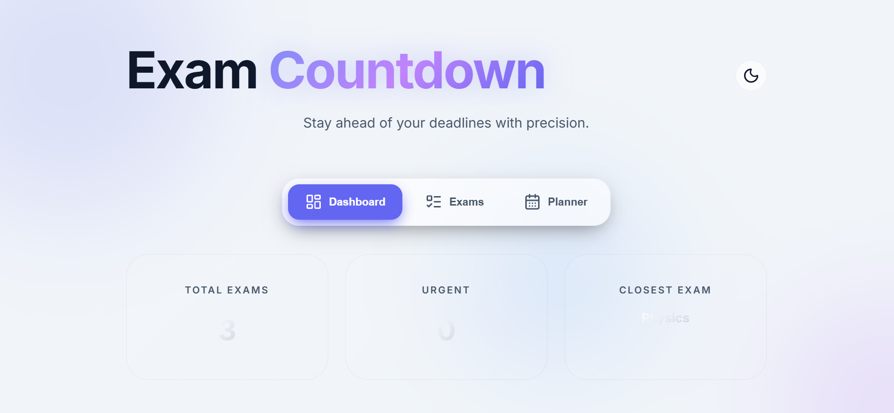
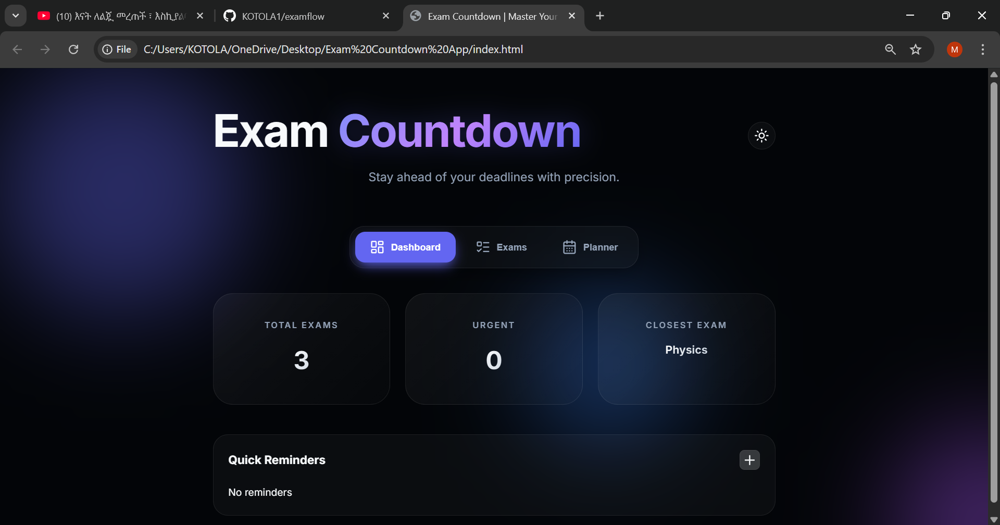
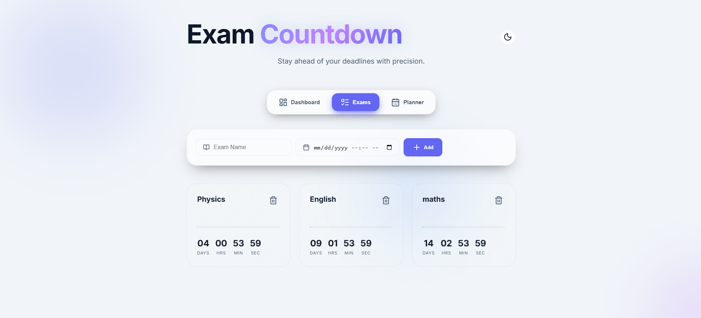

# Exam Countdown web App

A modern, responsive, and feature-rich web application designed to help students track their upcoming exams with precision and style.

[**Experience the app live here:**][(https://kotola1.github.io/examflow/)]

## 🌟 Features

- **Real-time Countdown**: Live ticker for days, hours, minutes, and seconds.
- **Visual Urgency System**: Cards change color (Red, Amber, Green) based on the proximity of the exam.
- **Dynamic Progress Bars**: Track the elapsed time for each exam visually.
- **Comprehensive Dashboard**: View total exams, urgent deadlines, and your closest focus target at a glance.
- **Weekly Planner**: A dynamic 7-day view mapping your exams to a timeline.
- **Quick Reminders**: Built-in system to jot down important study notes.
- **Dark/Light Mode**: Seamlessly switch between themes with persistence support.
- **Mobile Optimized**: Custom bottom navigation for an app-like experience on smaller screens.
- **Local Persistence**: All your data is saved locally in your browser.

## 🛠️ Technology Stack

- **HTML5**: Semantic and accessible markup.
- **CSS3**: Advanced glassmorphism design system with responsive animations.
- **JavaScript (ES6)**: Modern class-based logic for state and time management.
- **Lucide Icons**: Crisp, professional iconography.

## 🚀 Getting Started

1. **Clone the repository**:
   ```bash
   git clone https://github.com/KOTOLA1/examflow.git
   ```
2. **Open the project**:
   Simply open the `index.html` file in any modern web browser.

## 📸 Screenshots

<p align="center">
  
</p>
<p align="center">Countdown Feature</p>

<p align="center">
  
</p>
<p align="center">Main Dashboard</p>

<p align="center">
  
</p>
<p align="center">Detailed View</p>

<p align="center">
  
</p>
<p align="center">Exam List</p>
## 📄 License

This project is licensed under the MIT License - see the [LICENSE](LICENSE) file for details.

---
Built with ❤️ for better study habits.

      AUTHOR KOTOLA YACOB
